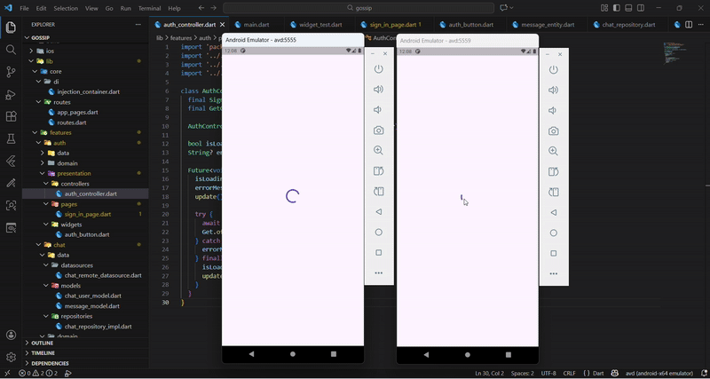

# Gossip
Chat app using firebase real time database where users can sign in anonymously and chat with other anonymously signed in user.

## Folder Structure
```
lib/
├── main.dart
│
├── core/
│   ├── di/
│   │   └── injection_container.dart
│   │
│   └── routes/
│       ├── routes.dart
│       └── app_pages.dart
│
├── features/
│   │
│   ├── auth/
│   │   ├── data/
│   │   │   ├── datasources/
│   │   │   │   └── auth_remote_datasource.dart
│   │   │   │
│   │   │   ├── models/
│   │   │   │   └── user_model.dart
│   │   │   │
│   │   │   └── repositories/
│   │   │       └── auth_repository_impl.dart
│   │   │
│   │   ├── domain/
│   │   │   ├── entities/
│   │   │   │   └── user_entity.dart
│   │   │   │
│   │   │   ├── repositories/
│   │   │   │   └── auth_repository.dart
│   │   │   │
│   │   │   └── usecases/
│   │   │       ├── sign_in_anonymously.dart
│   │   │       └── get_current_user.dart
│   │   │
│   │   └── presentation/
│   │       ├── controllers/
│   │       │   └── auth_controller.dart
│   │       │
│   │       ├── pages/
│   │       │   └── sign_in_page.dart
│   │       │
│   │       └── widgets/
│   │           └── auth_button.dart
│   │
│   └── chat/
│       ├── data/
│       │   ├── datasources/
│       │   │   └── chat_remote_datasource.dart
│       │   │
│       │   ├── models/
│       │   │   ├── chat_user_model.dart
│       │   │   └── message_model.dart
│       │   │
│       │   └── repositories/
│       │       └── chat_repository_impl.dart
│       │
│       ├── domain/
│       │   ├── entities/
│       │   │   └── message_entity.dart
│       │   │
│       │   ├── repositories/
│       │   │   └── chat_repository.dart
│       │   │
│       │   └── usecases/
│       │       ├── get_users.dart
│       │       ├── send_message.dart
│       │       └── get_messages.dart
│       │
│       └── presentation/
│           ├── controllers/
│           │   ├── users_controller.dart
│           │   └── chat_controller.dart
│           │
│           ├── pages/
│           │   ├── users_list_page.dart
│           │   └── chat_page.dart
│           │
│           └── widgets/
│               ├── user_list_tile.dart
│               └── message_bubble.dart
```

## Firebase Realtime DB Structure
```
Root
├── conversations
│   ├── UID01_UID02
│   │   ├── messages
│   │   │   ├── -OhLjL5Bb2SKjCKvSYpm
│   │   │   └── -OhLjOcpvQ3WGhCZ-mLH    
│   │   └── metadata
│   │       ├── participants: ["UID01", "UID02"]
│   │       ├── lastMessageTime: 1234567891
│   │       └── lastMessage: "Hi there!"
│   │
│   └── UID01_UID03
│       ├── messages
│       │   └── -OhO2vgry14Ias4keJe2
│       └── metadata
│           ├── participants: ["UID01", "UID03"]
│           ├── lastMessageTime: 1234567900
│           └── lastMessage: "How are you?"
│
└── users
    ├── UID01
    ├── UID02
    └── UID03
```

## Preview


